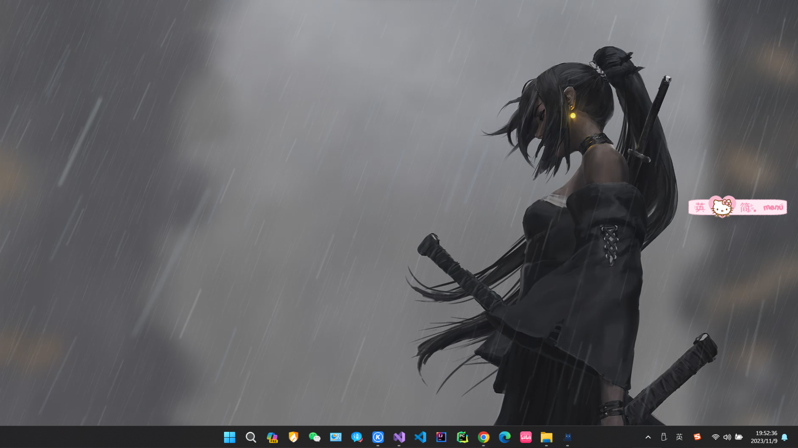
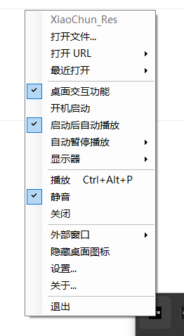

# XiaoChun_Res -Video to Dynamic Wallpaper

一个小而快并且功能强大的 Windows 动态桌面软件。支持视频和网页动画播放，支持 Windows10/11 系统。

## 📦 Download

https://pan.baidu.com/s/1VtWH1zbrwbomFhMejaZw8Q?pwd=0326
https://github.com/Lbeam08/XiaoChun_Res--Video-to-Dynamic-Wallpaper/releases/download/v1.0.0/XiaoChun_Res.-Video.to.Dynamic.Wallpaper.zip

## 📫 Features

- 支持视频播放
- 支持 URL 和网页文件
- 支持启动后自动播放
- 支持设置显示器
- 支持自动暂停播放
- 支持命令行播放

## 🌍 Roadmap

-  GIF 和 APNG 播放
-  鼠标和桌面交互
-  屏幕保护程序
-  更多视频格式
-  重新设计 UI
-  本地化
